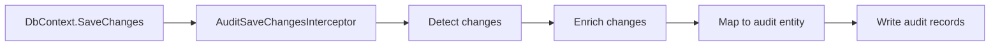

# Architecture

AuditLogLens is split into four stages.

```text
Detect -> Enrich -> Map -> Write
```



## Detect

The detector reads EF Core `ChangeTracker` entries before `SaveChanges`.

It creates `AuditChange` objects with:

- entity type;
- entity id;
- state;
- old values;
- new values;
- EF `EntityEntry`.

For added entities with generated keys, the real key is filled after the main save.

In the current public API, EF Core detection is the only built-in source of `AuditChange`.
Manual/event audit triggers are a planned extension point, but they are not exposed yet.

## Enrich

The enrichment stage makes audit changes readable.

It combines:

- domain-level config from `IHasAuditEnrichmentConfig<TSelf>`;
- application enrichers based on `AuditEntityEnricherBase`;
- reference, collection, override, and custom-step rules.

The important performance detail is global batching:

1. Build all plans.
2. Collect all load requests.
3. Group by target entity and property.
4. Load distinct keys.
5. Apply rules.

This avoids loading the same reference data separately for every audit change.

Application enrichers run around one official bag merge:

```text
all BeforeMerge hooks
merge bags into AuditChange
all AfterMerge hooks
```

`AuditEntityEnricherBase` uses a template method inside those phases:

- `BeforeMergeAsync(context)` for whole-save logic before the merge.
- `BeforeMergeChangeAsync(context, change, bag)` for simple per-change logic before the merge.
- `AfterMergeChangeAsync(context, change)` for simple per-change logic after the merge.
- `AfterMergeAsync(context)` for whole-save logic after the merge.

The per-change hooks run only for changes accepted by `CanHandle`.

## Map

Mapping can be default or application-owned.

By default, AuditLogLens maps `AuditChange` to `AuditLogLensEntry`.

If the application needs its own table shape, its `IAuditEntryMapper<TAuditEntry>` creates the real audit entity. This keeps the library independent from application-specific audit table schemas.

## Write

The default writer uses EF Core.

It:

- skips changes that still have no old/new values;
- maps audit changes;
- adds audit entities to the current `DbContext`;
- calls `SaveChanges`;
- suppresses recursive audit logging during the audit save.

## Public API Shape

The public API is intentionally centered on the types users write directly:

- `AuditExtensions`
- `AuditOptions`
- `AuditWriteMode`
- `AuditChange`
- `AuditLogLensEntry`
- `UseAuditLogLens()`
- `IAuditEntryMapper<TAuditEntry>`
- `AuditRestrictionsBase`
- `AuditRestrictionRules`
- `IHasAuditEnrichmentConfig<TSelf>`
- `IAuditEnrichmentPlanBuilder`
- `AuditEntityEnricherBase`
- `AuditEnrichmentContext`
- `AuditEnrichmentBag`

Runtime pipeline types are internal.

This means application code should not call the enrichment facade or writer directly. If manual audit sources are added later, they should go through a deliberate public pipeline API rather than depending on internal runtime classes.

## Related Pages

- [Getting Started](getting-started.md)
- [Enrichment](enrichment.md)
- [Transactions](transactions.md)
