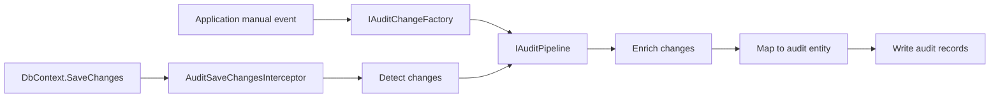

# Architecture

AuditLogLens is split into four stages.

```text
Detect -> Enrich -> Map -> Write
```



## Detect

The detector reads EF Core `ChangeTracker` entries before `SaveChanges`.

It creates `AuditChange` objects with:

- entity type;
- entity id;
- state;
- old values;
- new values;
- EF `EntityEntry`.

For added entities with generated keys, the real key is filled after the main save.

Automatic EF detection is one source of `AuditChange`.

Manual application events can also create changes explicitly with `IAuditChangeFactory`.
The factory does not inspect DTOs, calculate diffs, serialize payloads, or apply restrictions. It accepts the values the application has already decided to audit.

## Pipeline

`IAuditPipeline` is the shared source-agnostic stage.

It receives already-created `AuditChange` instances, then:

- enriches them;
- maps them;
- writes audit records according to the requested save behavior.

The pipeline does not call `ChangeTracker.DetectChanges()` and does not enumerate tracked entries. EF-specific snapshots are passed internally by the interceptor path when collection enrichment needs them.

## Enrich

The enrichment stage makes audit changes readable.

It combines:

- domain-level config from `IHasAuditEnrichmentConfig<TSelf>`;
- application enrichers based on `AuditEntityEnricherBase`;
- reference, collection, override, and custom-step rules.

The important performance detail is global batching:

1. Build all plans.
2. Collect all load requests.
3. Group by target entity and property.
4. Load distinct keys.
5. Apply rules.

This avoids loading the same reference data separately for every audit change.

Application enrichers run around one official bag merge:

```text
all BeforeMerge hooks
merge bags into AuditChange
all AfterMerge hooks
```

`AuditEntityEnricherBase` uses a template method inside those phases:

- `BeforeMergeAsync(context)` for whole-save logic before the merge.
- `BeforeMergeChangeAsync(context, change, bag)` for simple per-change logic before the merge.
- `AfterMergeChangeAsync(context, change)` for simple per-change logic after the merge.
- `AfterMergeAsync(context)` for whole-save logic after the merge.

The per-change hooks run only for changes accepted by `CanHandle`.

## Map

Mapping can be default or application-owned.

By default, AuditLogLens maps `AuditChange` to `AuditLogLensEntry`.

If the application needs its own table shape, its `IAuditEntryMapper<TAuditEntry>` creates the real audit entity. This keeps the library independent from application-specific audit table schemas.

## Write

The default writer uses EF Core.

It:

- skips changes that still have no old/new values;
- maps audit changes;
- adds audit entities to the current `DbContext`;
- optionally calls `SaveChanges`;
- suppresses recursive audit logging during audit-owned saves.

Automatic interceptor writes use immediate saving after the main save succeeds.

Manual pipeline calls default to adding audit entries to the current context without saving. A caller can opt into immediate saving with `AuditSaveBehavior.SaveImmediately`.

## Public API Shape

The public API is intentionally centered on the types users write directly:

- `AuditExtensions`
- `AuditOptions`
- `AuditPipelineSettings`
- `AuditSaveBehavior`
- `AuditWriteMode`
- `AuditChange`
- `AuditChangeState`
- `IAuditChangeFactory`
- `IAuditPipeline`
- `AuditLogLensEntry`
- `UseAuditLogLens()`
- `IAuditEntryMapper<TAuditEntry>`
- `AuditRestrictionsBase`
- `AuditRestrictionRules`
- `IHasAuditEnrichmentConfig<TSelf>`
- `IAuditEnrichmentPlanBuilder`
- `AuditEntityEnricherBase`
- `AuditEnrichmentContext`
- `AuditEnrichmentBag`

The enrichment facade and writer remain internal. Application code that needs manual audit sources should use `IAuditChangeFactory` and `IAuditPipeline` rather than depending on internal runtime classes.

## Related Pages

- [Getting Started](getting-started.md)
- [Enrichment](enrichment.md)
- [Transactions](transactions.md)
